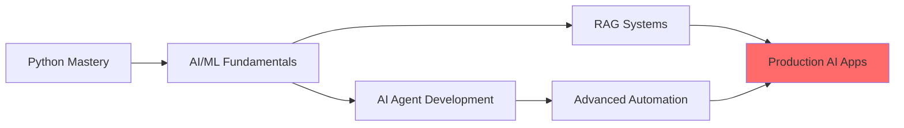

# 👋 Hi, I'm Tejas Sapara

<div align="center">
  
  [](https://www.linkedin.com/in/tejass-shapra-48507b23a)
  [](https://www.instagram.com/tej__.09?igsh=MXJqbTB3bWxweHN4aw==)
  [](mailto:tejassapara61@gmail.com)
  
  **Automation Enthusiast | AI Agent Developer | SaaS Builder**
  
  📍 Keshod, Gujarat, India
  
</div>

---

## 🚀 About Me

I'm a passionate developer specializing in **AI-powered automation** and **intelligent systems**. I transform complex workflows into seamless automated solutions using cutting-edge technologies.

- 🤖 Currently working on **AI Agent automation**
- 📚 Learning **AI Agents**, **Firebase & Supabase**, and **RAG (Retrieval-Augmented Generation)**
- 🤝 Open to collaborate on **AI Agents**, **n8n workflows**, and **SaaS projects**
- 💬 Ask me about **AI automation**, **Python**, **RAG systems**, and **n8n integrations**
- ⚡ Fun fact: I analyze everything before building it – from user behavior to system architecture!

---

## 💻 Complete Tech Stack

### 🐍 Programming Languages
<p align="left">
  
  
  
  
</p>

### ⚛️ Frontend Development
<p align="left">
  
  
  
</p>

### 🤖 AI & Machine Learning
<p align="left">
  
  
  
  
</p>

### ⚙️ Automation & Workflows
<p align="left">
  
  
</p>

### 🗄️ Backend & Databases
<p align="left">
  
  
  
  
  
  
</p>

### 🔌 APIs & Integration
<p align="left">
  
  
  
</p>

### 🎨 Design Tools
<p align="left">
  
  
</p>

### ☁️ Cloud & DevOps
<p align="left">
  
  
  
  
  
</p>

### 🛠️ Other Tools
<p align="left">
  
  
  
</p>

---

## 🌟 Featured Projects

### 🚀 [Mahi 1.0](https://github.com/tejassapara61-stack/mahi-1.0)
<div align="left">
  
  
  
</div>

**🎯 Project Overview:**
> Advanced AI-powered automation system featuring intelligent workflows and multi-agent orchestration

**🔧 Tech Stack:**
- Python | AI Agents | n8n
- RAG System | OpenAI
- Firebase/Supabase Backend

**✨ Key Features:**
- 🤖 Multi-agent AI orchestration
- 🔄 Automated workflow optimization
- 📊 Real-time analytics dashboard
- 🔌 Seamless API integrations
- 🧠 Context-aware decision making

**[View Project →](https://github.com/tejassapara61-stack/mahi-1.0)**

---

### 🌱 [Green-GO](https://github.com/tejassapara61-stack/green-GO)
<div align="left">
  
  
  
</div>

**🎯 Project Overview:**
> Sustainable tech solution combining modern web technologies with eco-friendly practices

**🔧 Tech Stack:**
- React | Node.js
- Firebase | RESTful API
- Python Backend

**✨ Key Features:**
- 🌿 Environmental impact tracking
- 📱 Responsive web application
- 🔐 Secure authentication system
- 📈 Data visualization
- ⚡ Real-time updates

**[View Project →](https://github.com/tejassapara61-stack/green-GO)**

---

## 🎯 Current Focus

```python
current_projects = {
    "learning": ["AI Agents", "Firebase", "Supabase", "RAG"],
    "working_on": ["Automation Systems", "AI Agent Development"],
    "collaborating": ["AI Agents", "n8n Workflows", "SaaS Solutions"],
    "expertise": ["Python", "AI", "React", "RAG", "n8n", "Automation"]
}
```

---

## 🛠️ Services I Offer

<table>
  <tr>
    <td align="center" width="33%">
      
      <br><b>AI Development</b>
      <br>Custom AI agents, RAG systems, and intelligent automation solutions
    </td>
    <td align="center" width="33%">
      
      <br><b>n8n Automation</b>
      <br>Complex workflow automation, API integrations, and process optimization
    </td>
    <td align="center" width="33%">
      
      <br><b>SaaS Development</b>
      <br>Full-stack web applications with modern frameworks and cloud services
    </td>
  </tr>
</table>

---

## 📚 Latest Blog Posts & Articles

<!-- BLOG-POST-LIST:START -->
- 🤖 Building AI Agents with n8n: A Complete Guide
- 🔥 Firebase vs Supabase: Choosing the Right Backend
- 📊 Implementing RAG Systems for Better AI Responses
- ⚡ Automating Workflows: Best Practices with n8n
<!-- BLOG-POST-LIST:END -->

*Want me to write about a specific topic? [Drop me a message!](mailto:tejassapara61@gmail.com)*

---

## 🎓 Certifications & Learning Path



**Currently Pursuing:**
- 🎯 Advanced AI Agent Architectures
- 🎯 Firebase & Supabase Deep Dive
- 🎯 Production-Grade RAG Systems
- 🎯 Enterprise n8n Workflows

---

## 💡 What I'm Working On This Week

```python
weekly_goals = {
    "monday": "Building multi-agent RAG system",
    "tuesday": "n8n workflow optimization",
    "wednesday": "Firebase authentication integration",
    "thursday": "AI agent training pipeline",
    "friday": "Open source contributions",
    "weekend": "Learning new AI frameworks"
}

def get_current_focus():
    return "Creating intelligent automation that scales 🚀"
```

---

## 🌟 Open Source Contributions

I actively contribute to the automation and AI community:

- 🔧 **n8n Community Nodes** - Custom integrations and workflows
- 🤖 **AI Agent Templates** - Reusable agent architectures
- 📦 **Python Libraries** - Automation utilities and helpers
- 📖 **Documentation** - Tutorials and implementation guides

---

## 🤝 Let's Collaborate!

I'm actively looking to collaborate on:

- 🤖 **AI Agent Projects** - Building intelligent automation systems
- ⚙️ **n8n Workflows** - Complex automation solutions
- 💼 **SaaS Applications** - Scalable cloud services
- 🔗 **API Integrations** - Connecting systems seamlessly

---

## 📈 Coding Activity

<div align="center">
  
  

</div>

---

## 📊 GitHub Stats

<div align="center">
  
  
  
  
  
  

</div>

---

## 🎯 2025 Goals

- [ ] Build and launch 3 production AI agents
- [ ] Contribute to 10+ open source projects
- [ ] Master Firebase & Supabase ecosystem
- [ ] Create advanced RAG system framework
- [ ] Build a popular n8n community node
- [ ] Grow developer community to 1K+ followers
- [ ] Launch my own SaaS product

---

## 🏆 Achievements

<div align="center">
  
  
  
</div>

---

## 🤝 Support My Work

If you find my projects helpful:

- ⭐ Star my repositories
- 🍴 Fork and contribute
- 📢 Share with your network
- 💬 Provide feedback and suggestions

---

## 📫 Get In Touch

- 💼 LinkedIn: [Tejas Sapara](https://www.linkedin.com/in/tejass-shapra-48507b23a)
- 📸 Instagram: [@tej__.09](https://www.instagram.com/tej__.09?igsh=MXJqbTB3bWxweHN4aw==)
- 📧 Email: tejassapara61@gmail.com
- 🐙 GitHub: [@tejassapara61-stack](https://github.com/tejassapara61-stack)

**🤝 Open for:**
- Freelance projects
- Collaboration opportunities
- Technical consulting
- Speaking engagements

---

<div align="center">
  
  ### 💡 "Automating the future, one workflow at a time"
  
  
  
  ⭐️ From [tejassapara61-stack](https://github.com/tejassapara61-stack)
  
</div>
